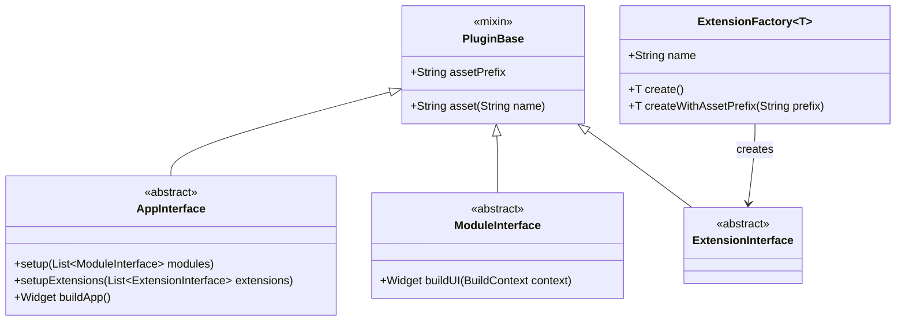
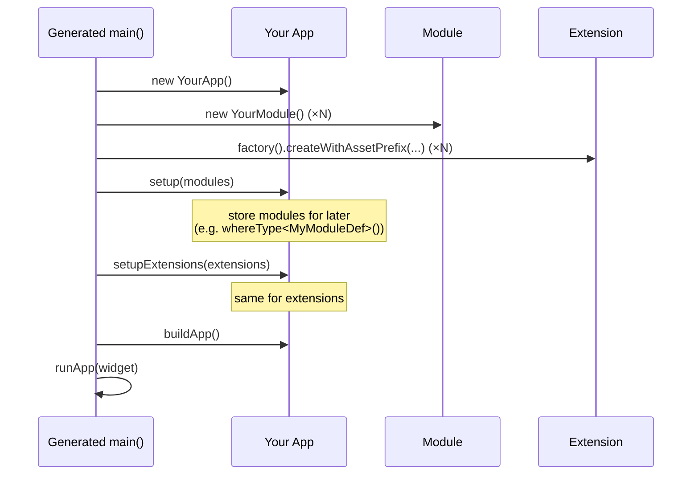

# mss_core

Base interfaces for the [Memention Software Shop](https://mss.memention.net)
plugin system.

Flutter plugins (apps, modules, extensions) implement types from this package
so they can be assembled into a running app by the [MSS
client](https://github.com/flutter-mss/mss_app).

## Install

```yaml
dependencies:
  mss_core:
    git:
      url: https://github.com/flutter-mss/mss_core.git
      ref: main
```

You can also use `path: ../mss_core` during local monorepo-style development.
The combiner rewrites such path deps when it assembles an app, so they don't
need to resolve at publish time. (See [Pubspec conventions](#pubspec-conventions).)

## License

MIT. See [LICENSE](LICENSE).

---

# Plugin author guide

A plugin is a standalone Dart package that subclasses exactly one of
`AppInterface`, `ModuleInterface`, or `ExtensionInterface`. Publish it to any
git repo, register it through the MSS client, and end users can pull it into
assembled apps.

## The three kinds of plugin



| Kind | Subclass | Purpose | Count per app |
|---|---|---|---|
| **App** | `AppInterface` | Top-level shell; owns the root widget and wires modules/extensions. | exactly 1 |
| **Module** | `ModuleInterface` | A self-contained feature surface (photo gallery, score HUD, settings pane). | any |
| **Extension** | `ExtensionInterface` (or a subclass *definition*) | A small pluggable piece (image filter, physics rule, asset pack). Apps enumerate them via `.whereType<T>()`. | any |

Apps see the modules/extensions the user picked as plain Dart lists — no DI
container, no reflection. You decide what to do with them.

## Lifecycle at runtime



The combiner generates `main.dart` and `plugin_registry.dart` automatically —
you never write them yourself. What you write is just the subclasses and a
`factory()` (for extensions).

---

## Your first plugin — a module

We'll build a minimal *greeter* module that draws "Hello from `<name>`".

### 1. Create the package

```bash
flutter create --template=package demo_greeter
cd demo_greeter
```

### 2. `pubspec.yaml`

```yaml
name: demo_greeter
description: Says hello.
version: 1.0.0

environment:
  sdk: ^3.0.0
  flutter: ">=3.0.0"

dependencies:
  flutter:
    sdk: flutter
  mss_core:
    git:
      url: https://github.com/flutter-mss/mss_core.git
      ref: main
```

### 3. `lib/demo_greeter.dart`

```dart
export 'src/greeter.dart';
```

### 4. `lib/src/greeter.dart`

```dart
import 'package:flutter/material.dart';
import 'package:mss_core/mss_core.dart';

class Greeter extends ModuleInterface {
  @override
  Widget buildUI(BuildContext context) {
    return const Center(
      child: Text('Hello from demo_greeter', style: TextStyle(fontSize: 24)),
    );
  }
}
```

That's a complete module. Publish it to a git repo, register it through the
client, and any app that declares a matching interface requirement can pick
it up.

---

## App plugins

Apps are the shell. They receive modules and extensions and decide how to
lay them out.

```dart
import 'package:flutter/material.dart';
import 'package:mss_core/mss_core.dart';

// Interface definition from a *_def package; usually a separate package.
import 'package:demo_gallery_module_def/demo_gallery_module_def.dart';
import 'package:demo_image_filter_def/demo_image_filter_def.dart';

class MyPhotoApp extends AppInterface {
  late List<ModuleInterface> _modules;
  List<ImageFilterDefinition> _filters = const [];

  List<GalleryModuleDefinition> get galleries =>
      _modules.whereType<GalleryModuleDefinition>().toList();

  @override
  void setup(List<ModuleInterface> modules) {
    _modules = modules;
  }

  @override
  void setupExtensions(List<ExtensionInterface> extensions) {
    _filters = extensions.whereType<ImageFilterDefinition>().toList();
  }

  @override
  Widget buildApp() {
    return MaterialApp(
      title: 'Photo Viewer',
      home: PhotoHome(galleries: galleries, filters: _filters),
    );
  }
}
```

Key points:

- **`setup(modules)` is called before `setupExtensions(extensions)`**, both
  before `buildApp()`.
- **`setupExtensions` defaults to a no-op** in `AppInterface`. Only override
  it if you actually use extensions — apps that don't, can ignore it.
- **Use `.whereType<T>()`** to filter the flat list down to the definition
  types you care about. The user-selected module of type `MyModuleDef` and
  the user-selected filter of type `ImageFilterDefinition` are already typed
  instances; no casting needed.

## Extension plugins

Extensions extend a definition — usually a subclass of `ExtensionInterface`
published as its own *def* package (see [Interface definitions](#interface-definitions)).

```dart
import 'package:flutter/material.dart';
import 'package:mss_core/mss_core.dart';
import 'package:demo_image_filter_def/demo_image_filter_def.dart';

class GrayscaleFilter extends ImageFilterDefinition {
  @override
  String get filterName => 'Grayscale';

  @override
  Widget wrap(Widget child) => ColorFiltered(
        colorFilter: const ColorFilter.matrix([
          0.2126, 0.7152, 0.0722, 0, 0,
          0.2126, 0.7152, 0.0722, 0, 0,
          0.2126, 0.7152, 0.0722, 0, 0,
          0,      0,      0,      1, 0,
        ]),
        child: child,
      );

  @override
  Widget buildPreview(BuildContext context) => /* ... */;
}

// The combiner looks for a top-level `factory()` function.
ExtensionFactory<GrayscaleFilter> factory() => ExtensionFactory(
      name: 'Grayscale',
      create: () => GrayscaleFilter(),
    );
```

### Why the factory?

The combiner needs to hand extensions to the app with their `assetPrefix`
already set (so `asset('x.png')` resolves correctly at runtime — see
[Assets](#assets)). The factory indirection lets the combiner do that
without requiring authors to accept a prefix in the constructor:

```dart
// Generated plugin_registry.dart
List<ExtensionInterface> createExtensions() {
  return [
    demo_grayscale_filter.factory()
        .createWithAssetPrefix('packages/demo_grayscale_filter/assets/'),
    // ...
  ];
}
```

`ExtensionFactory.createWithAssetPrefix(prefix)` calls your `create()`, sets
`instance.assetPrefix = prefix`, and returns the instance. If you want to
preconfigure state beyond assets, do it in `create`.

## Interface definitions

When a module or extension is *substitutable* — i.e. the app shouldn't care
which concrete implementation is plugged in — publish the abstract contract
as its own package, conventionally named `<thing>_def`.

```dart
// demo_image_filter_def/lib/src/image_filter_definition.dart
import 'package:flutter/widgets.dart';
import 'package:mss_core/mss_core.dart';

abstract class ImageFilterDefinition extends ExtensionInterface {
  String get filterName;
  Widget wrap(Widget child) => child;  // default identity
  Widget buildPreview(BuildContext context);
}
```

This gives you three benefits:

1. **Apps depend on the def, not the impl.** `MyPhotoApp` imports
   `demo_image_filter_def`; `GrayscaleFilter` and `SepiaFilter` each also
   import it. At build time the user picks one or both; the app code never
   changes.
2. **The registry can typecheck.** When a plugin says *"I implement
   `ImageFilterDefinition`"* the server can verify it at publish time by
   resolving the type.
3. **The picker UI can group.** "Extensions for this app: *Image
   Filters → [Grayscale, Sepia, ...]*" is driven by the interface name.

---

## Assets

Dart package assets are served under
`rootBundle` as `packages/<pkg_name>/assets/<path>`. Authors shouldn't have
to hardcode that prefix — the combiner wires it up.

Declare assets in your pubspec the usual way:

```yaml
flutter:
  assets:
    - assets/photos/
```

In your code, use `asset(name)` (inherited from `PluginBase`):

```dart
Image.asset(asset('photos/bird.png'))  // resolves to
                                       // 'packages/your_pkg/assets/photos/bird.png'
```

At assembly time:

- **Modules** get `assetPrefix = 'packages/<your_pkg>/assets/'` via the
  public setter on `PluginBase` before `setup` runs.
- **Extensions** get it via `ExtensionFactory.createWithAssetPrefix`, so
  your extension instance is ready to use when the app receives it.
- **Apps** get it too — so if your app ships its own assets, `asset('x.png')`
  works from inside `buildApp()`.

During standalone local dev (running your module's package directly via
`flutter run`), the prefix is empty and `asset(name)` returns `name` — so
use local paths that match your on-disk layout and things still work.

## Pubspec conventions

The combiner handles a few monorepo-style patterns that would otherwise
break when plugins are cloned from distinct git repos.

### `path:` deps to `mss_core`

During local development it's common to write:

```yaml
dependencies:
  mss_core:
    path: ../mss_core
```

That path only resolves inside a monorepo checkout. When the combiner
assembles from git clones, the path wouldn't exist. Instead of rewriting
your pubspec, the combiner clones `mss_core` from its canonical repo and
writes a `dependency_overrides` block that collapses every `../mss_core`
to that single clone. Your pubspec stays clean.

### `path:` deps to sibling `demo_*_def` packages

Same treatment: if your plugin declares a sibling def package via
`path: ../demo_foo_def`, the combiner finds the first actually-existing
instance (typically co-located in the same git repo) and overrides all
other references to that name.

### Naming

- **Package name = plugin name.** The combiner uses the value of `name:`
  in your `pubspec.yaml` directly as the Dart package name in the assembled
  build. Don't re-prefix with `demo_` or similar in the MSS registry
  metadata — the server just stores it verbatim.
- **Class names can be anything valid.** Register the class name through
  the MSS client when publishing; the combiner generates
  `import ...; final app = YourClass();` using that value.

## Publishing

Through the MSS client (`mss_app`):

1. Sign in (register + verify email if you haven't yet).
2. Go to the *Plugins* tab (only visible when signed in).
3. *New plugin* → fill in name, display name, class name, type
   (app/module/extension), interface it implements/requires, git repo,
   git SHA, and optionally a subpath if your plugin lives in a subdirectory
   of a multi-package repo.
4. Upload an icon (PNG/JPG/SVG; SVGs get rasterized to the macOS icon
   slots when an app plugin is assembled).

The registry stores the git ref + SHA, not the source. Updates require
publishing a new SHA — immutable by design, so assembled apps stay
reproducible.

## Reference plugins

These are working reference implementations. Keep one open while building
your first plugin.

- **[demo_photoapp](https://github.com/flutter-mss/demo_photoapp)** —
  seven-package bundle (app shell, gallery module, two filter extensions,
  three def packages). Good for seeing multi-package git-subpath publishing.
- **[demo_flappybird](https://github.com/flutter-mss/demo_flappybird)** —
  playable game with swappable physics and asset-pack extensions.
  Demonstrates non-trivial module internals.
- **[demo_alternative_physics](https://github.com/flutter-mss/demo_alternative_physics)** —
  single-package extension in its own repo. Minimal case.

## Pitfalls

- **Re-prefixing the plugin name.** If your package is named
  `demo_my_photoapp`, don't register it as `demo_demo_my_photoapp`.
  The server stores `name` verbatim; the combiner uses it as the Dart
  package name.
- **Forgetting `setupExtensions`.** The default is a no-op, so your
  extensions silently don't reach the UI. If your app picks up extensions
  anywhere, override it.
- **Depending on the wrong Flutter SDK range.** Plugins are assembled into
  a project that runs on the client's Flutter. A very old `flutter: ">=3.0.0"`
  is fine; pinning `sdk: ^3.11.4` will break users on older toolchains.
- **Forgetting to publish assets in `pubspec.yaml`.** Flutter won't bundle
  `assets/` unless you declare it under `flutter: assets:`. The
  `assetPrefix` dance only helps you *reference* assets; they still need to
  be declared.

---

<!-- image: assembled-app
prompt: "Three-panel illustration showing the plugin assembly concept:
(1) left panel — three labelled puzzle pieces on a grey workbench ('App
shell', 'Gallery module', 'Grayscale filter'); (2) middle panel — a hand
snapping them together; (3) right panel — a finished macOS app window
titled 'Photo Viewer' with a grid of colorful photos. Clean flat vector
style, muted purple accent, minimal background. No real photos, just
abstract coloured tiles."
-->

## See also

- [Workspace CLAUDE.md](https://github.com/flutter-mss/mss_app/blob/main/CLAUDE.md)
  — operational notes on the assembly pipeline
- [mss_app](https://github.com/flutter-mss/mss_app) — the client that
  orchestrates all of this
- [.github profile](https://github.com/flutter-mss) — top-level overview
